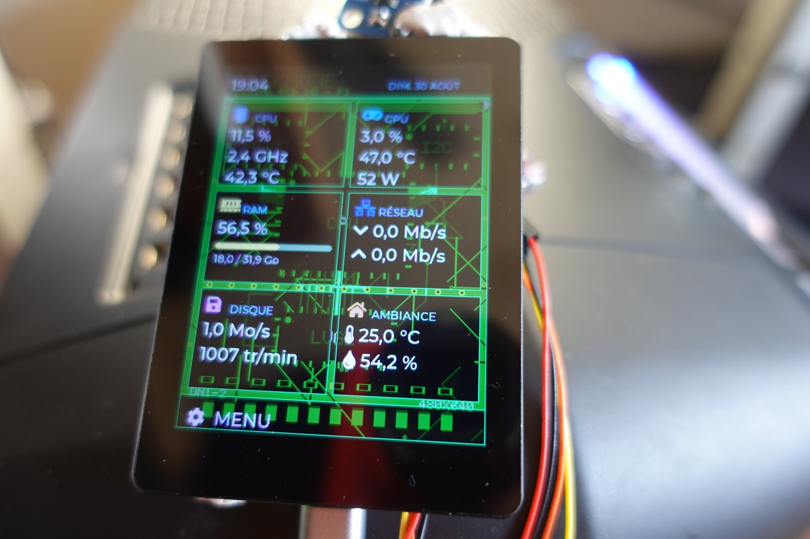
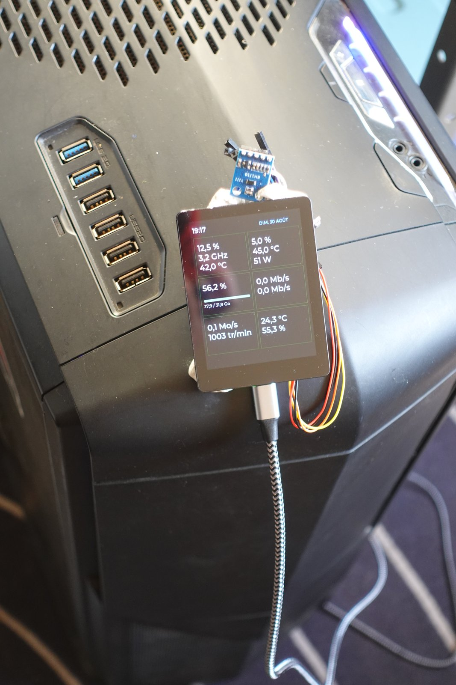
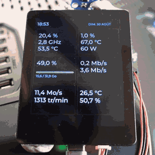
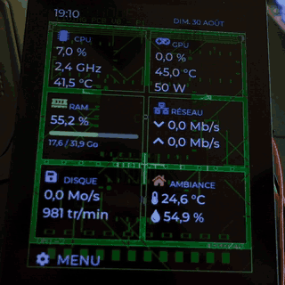
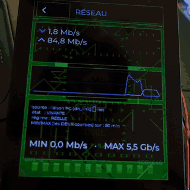

# DeskNode

**DeskNode is a physical desktop dashboard: a small touchscreen that sits next to your PC and shows, at a glance, what the machine and the room around it are doing.**

**Open source** — firmware **GPL-3.0-or-later** · Windows agent **MIT** · docs and hardware **CC-BY-SA-4.0**. What that means for you: [`LICENSING.md`](LICENSING.md).

**Built on** an **ESP32-S3** board with a **2.8-inch touchscreen** (Waveshare ESP32-S3-Touch-LCD-2.8B, 480×640 IPS), fed **PC telemetry** over USB by a small Windows agent, with optional **I²C sensors** for the room.

## What it shows

Six cells: **CPU** · **GPU** · **RAM** · **NETWORK** · **DISK** · **AMBIENT** (room temperature and humidity). The screen has two states: **Ambient**, a calm view that stays on, and **Active**, the full *Living PCB* view, one touch away.

**About these photos (2026-08-30).** What you see is the **prototype**: bare wiring, a sensor breakout above the screen, **no enclosure**. This first version ships without one, and that is assumed rather than hidden. The screen in the photos speaks **French**; a freshly flashed board starts in **English** (see *Language* below). There is no logo yet: the name above stands in for one.

## Demo

[Watch the 78-second demo video on YouTube](https://youtu.be/tcCF3vogwSU). The three animations below are silent excerpts of it, a few seconds each.

**About this video (2026-08-30).** It was filmed on the same day as the photos above, and it shows the same **prototype**: bare wiring, **no enclosure**. The screen in the video speaks **French**; a freshly flashed board starts in **English**.

## Two hardware tiers

| tier | what you buy | what it adds |
|---|---|---|
| **DeskNode** | the Waveshare ESP32-S3-Touch-LCD-2.8B board, **alone** | nothing to solder |
| **DeskNode + Ambiance** | the same board | a **BME680** (temperature, humidity) and a **BH1750** (light) on the I²C header |

The board alone is **not a degraded mode**: the firmware knows it has no sensor, says so, and turns off what has no input. What it costs is simple: without the sensors, the **AMBIENT** cell has nothing to show.

- What to buy, with exact part numbers and dated prices: [docs/bom.md](docs/bom.md)
- Where to plug the sensors, and how to check that the bus answers: [docs/cablage.md](docs/cablage.md)
- The enclosure — where its files will live, and why none is required: [docs/boitier.md](docs/boitier.md)

⚠️ `docs/cablage.md` and `docs/boitier.md` are in French for now; `docs/bom.md` is in English.

**Buy it** — these five links are **affiliate links**: they may pay this project, and cost you nothing more.
[Board](https://www.waveshare.com/esp32-s3-touch-lcd-2.8b.htm?&aff_id=180651) · [BME680](https://s.click.aliexpress.com/e/_c4Dp3sBL) · [BH1750](https://s.click.aliexpress.com/e/_c4OQ98X7) — that is a whole DeskNode + Ambiance.
Also on the prototype, ⛔ not needed for a V1: [VL6180X](https://s.click.aliexpress.com/e/_c3w7WL8h) · [INA219](https://s.click.aliexpress.com/e/_c3vm4Fkp). Prices, exact references and terms: [docs/bom.md](docs/bom.md).

## Install

**Double-click `installeur/DeskNode-installeur.bat`.** It starts a small server **on your own machine** (`http://127.0.0.1:<port>`) and opens your browser on a page that **flashes the firmware onto the board** — no toolchain, no driver, and **no administrator rights**.

What you still install yourself:

- **Python 3** for Windows — tick *"Add python.exe to PATH"* in the official installer.
- The agent's two modules, **`psutil`** and **`pyserial`**. The install page has a button for them, or run `pip install --user psutil pyserial`.
- **LibreHardwareMonitor** — **optional**. Without it the agent still starts (after waiting for it, 5 minutes by default), and only the CPU temperature and the fan speeds stay at `--`. Installing it **requires administrator rights** (a signed kernel driver and an elevated scheduled task), which is why the install page does not do it for you.

If you **downloaded** the `.bat` instead of cloning the repository, Windows may warn you on first launch: right-click the file → *Properties* → tick **Unblock** → *OK*.

A standalone executable for the agent, so that none of the above is needed, is planned for **V0.2**.

⚠️ Activating the agent from a downloaded copy of the repository is expected to fail today: see [Known issues](#known-issues).

**Building the firmware from source** (ESP-IDF, on Linux or WSL): see [`CONTRIBUTING.md`](CONTRIBUTING.md).

## Language

The screen starts in **English**. **French** can be selected on the install page, which writes the choice to the board after flashing; the choice survives a reboot. The install page itself opens in English, with French one click away. The serial console stays in **French**: it is a diagnostic tool written for development, not the product.

## Known issues

- **Cold start: the whole I²C bus degrades for ~40 s.** On about **1 cold start in 6**, multi-byte transactions fail across the **whole I²C bus** for roughly the first 40 seconds — the touch controller's reads failed **55.5 %** of the time, so touch is unresponsive — then recover **on their own**. On a *DeskNode + Ambiance* build, the room sensors can stay empty until **about a minute** after power-on. The root cause is **not established**.
- **Activating the agent from a downloaded copy is expected to fail.** On a clone or a downloaded archive of this repository, the install page's *Activate the agent* step should be refused with exit code `3`: the launcher expects the agent **next to itself** (`tools/dn_agent.py`), a layout that only the author's own deployment script produces. This was established on 2026-09-14 by reading `tools/dn_agent_tour.ps1` (and by an earlier run of that launcher from a copy of the repository); it has ⛔ not yet been observed on a downloaded copy. The standalone executable planned for **V0.2** is what removes that step.
- **Navigation is slower than targeted.** Opening a detail page takes **335.8 ms** on average against a **300 ms** target (n = 80, range 281.2–400.9 ms, measured 2026-08-22).
- **Portability:**
  - the agent runs on **Windows only**;
  - GPU metrics come from **AMD only** (ADL);
  - NVIDIA GPUs: **not implemented** — the agent has no NVML support;
  - **Intel Arc** and integrated GPUs: **untested**;
  - the whole stack has been proven on **one board**, the development one. If you build one, you are among the first: tell us what you see.

## Status and help

- What to expect from this project — maintenance, support, feature requests: [What this project is, honestly](CONTRIBUTING.md#what-this-project-is-honestly)
- Something wrong? [Open a bug report](https://github.com/nasbarok/desknode/issues/new?template=bug_report.yml) — the form asks for what helps.
- A **security vulnerability**? **Not in an issue**, which is public: follow [`SECURITY.md`](SECURITY.md).
- How people are expected to behave here, and what can and cannot be done when they do not: [`CODE_OF_CONDUCT.md`](CODE_OF_CONDUCT.md)

## More

- Building, reporting a bug, contributing: [`CONTRIBUTING.md`](CONTRIBUTING.md)
- What changed: [`CHANGELOG.md`](CHANGELOG.md)
- Third-party components and their licenses: [`THIRD-PARTY.md`](THIRD-PARTY.md)
- What is still to come: [`docs/roadmap.md`](docs/roadmap.md)
- The full engineering log — every measurement, decision and dead end, **in French**: [`docs/journal-de-bord.md`](docs/journal-de-bord.md)
